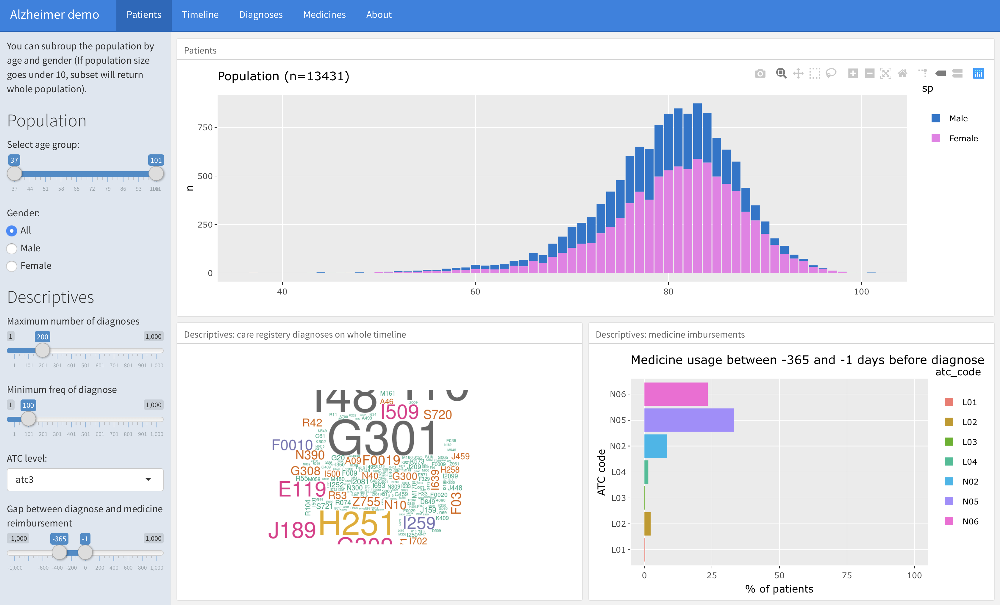
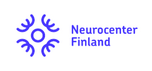
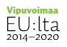

# Alzheimer disease patient timeline ShinyApp 

Explore timeline of Alzheimer patients doctoral visits and medicine reimbursement. Timeline is at maximum 15 years before and after the diagnose (day when patient got medicine special reimbursement right, `erko307`). Demo dataset is synthetic and has total number of 13 431 patient. Datasets are not available in GitHub repository.


## How to clone and develop application in databricks Rstudio cluster

1. Launch RStudio Cluster in databricks and login. Check guide how to install RStudio in databricks cluster [here](https://docs.databricks.com/spark/latest/sparkr/rstudio.html).

2. Copy ssh key to Github. In RStudio terminal run commands

```
ssh-keygen
cat ~/.ssh/id_rsa.pub
```

to generate ssh-keyfile and copy ssh-key file to Github keys <https://github.com/settings/keys>.


3. Clone project to databricks Rstudio cluster

```
git clone git@github.com:pohjois-savon-tietoallas/alzdemo.git
$git clone https://github.com/pohjois-savon-tietoallas/alzdemo.git # without ssh
```

4. Setup git user credentials

```
git config --global user.email "user.name@mail.fi"
git config --global user.name "User Name"
```

5. Open project and run `shinyapp.Rmd` (alt + shift + K) 




## Acknowledgements

We are grateful for all [contributors](https://github.com/pohjois-savon-tietoallas/alzdemo/graphs/contributors/) including Reijo Sund, Juho Kopra and Pohjois-Savo Ai-Hub Team. Also we are grateful for funders and [Neurocenter Finland](https://neurocenterfinland.fi/) which made this project possible to develop.

<p align="center">
  
  
  
  
</p>

**Datasets** are synthetic, but represent real world data. Original datasets are not freely available. If you are interested of the datasets, please contact [Reijo Sund](mailto://reijo.sund@uef.fi).</br>

**Licence:** [CC BY](https://creativecommons.org/licenses/by/4.0/). This license allows reusers to distribute, remix, adapt, and build upon the material in any medium or format, so long as attribution is given to the creator. The license allows for commercial use.</br>

**Citing:** Kindly cite this work as  follows; Jani Miettinen and Reijo Sund. Alzheimer disease patient timeline Shiny Application. URL: https://github.com/pohjois-savon-tietoallas/alzdemo

